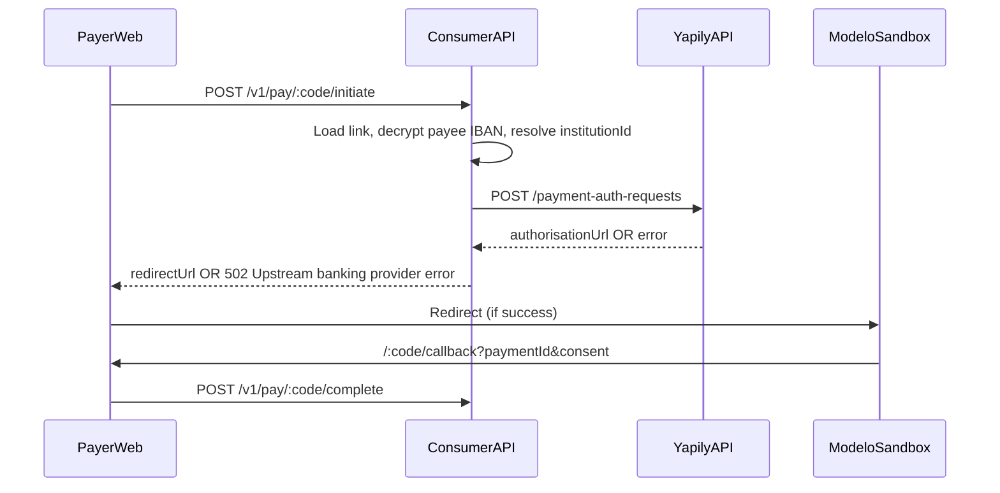

# Payspin — Payer “Upstream banking provider error” deep debug & fix

> **Purpose:** One-shot agent prompt to **diagnose, fix, test end-to-end, and deploy** the payer payment flow when tapping **“Pay with my bank”** on `pay.payspin.io` (or local `:3000`) shows **“Upstream banking provider error”**.
>
> **Symptom (reported):** Payer opens a link (e.g. €20.00 “theatre” to Mahmoud AlHaroon) → taps **Pay with my bank** → red error **Upstream banking provider error** (no bank redirect).
>
> **Technical mapping:** That message is returned by [`AllExceptionsFilter`](../../backend/src/interfaces/http/filters/all-exceptions.filter.ts) when a [`YapilyApiError`](../../backend/src/infrastructure/yapily/yapily-http.client.ts) is thrown — almost always from `POST /v1/pay/:code/initiate` → `PIS_GATEWAY.createPaymentAuthRequest` → Yapily `POST /payment-auth-requests`.

---

## How to use

1. Open a **new Agent chat** on `main` or `dev`.
2. Paste the **SHORT PROMPT** from the bottom of this file (or the full **COPY BLOCK** for maximum context).
3. Say: **Execute end-to-end. Do not stop after planning. Run until FINAL REPORT.**
4. Agent must fix, deploy, and prove **100% pass** on the test matrix below.

**Accounts:** payspin.app@gmail.com (Hetzner, Docker Hub, Yapily Console). **Never commit** `.env` or secrets.

---

## Production context (agent must use)

| Item | Value |
|------|--------|
| Payer web | https://pay.payspin.io |
| Consumer API | https://pay.payspin.io/v1 |
| Ops portal | https://ops.payspin.io (`admin@payspin.app` / `PayspinOps!2026`) |
| Hetzner | `178.105.118.225` · SSH `ssh -i ~/.ssh/id_ed25519_payspin root@178.105.118.225` |
| Server env | `/opt/payspin/.env.production` |
| Yapily app | [Console → Payspin](https://console.yapily.com/applications/53b0d904-21b3-41a7-ba2b-e440ab460bf9) |
| Default institution | `modelo-sandbox` |
| Sandbox bank login | `mits` / `mits` |
| Deploy consumer | `PAYSPIN_SERVER_IP=178.105.118.225 ./infrastructure/hetzner/deploy.sh` |
| Deploy ops | `PAYSPIN_SERVER_IP=178.105.118.225 ./infrastructure/hetzner/deploy-ops.sh` |

---

## Payment flow (what to trace)



**Key files:**

| Layer | Path |
|-------|------|
| Payer button | [`frontend/app/[code]/pay-button.tsx`](../../frontend/app/[code]/pay-button.tsx) |
| Payer API client | [`frontend/lib/api.ts`](../../frontend/lib/api.ts) |
| Initiate use case | [`backend/src/application/use-cases/payments/initiate-payer-payment.use-case.ts`](../../backend/src/application/use-cases/payments/initiate-payer-payment.use-case.ts) |
| Complete use case | [`backend/src/application/use-cases/payments/complete-payer-payment.use-case.ts`](../../backend/src/application/use-cases/payments/complete-payer-payment.use-case.ts) |
| Yapily PIS gateway | [`backend/src/infrastructure/yapily/yapily-pis.gateway.ts`](../../backend/src/infrastructure/yapily/yapily-pis.gateway.ts) |
| Yapily HTTP client | [`backend/src/infrastructure/yapily/yapily-http.client.ts`](../../backend/src/infrastructure/yapily/yapily-http.client.ts) |
| Institution routing | [`backend/src/domain/utils/institution-routing.ts`](../../backend/src/domain/utils/institution-routing.ts) |
| Payment request builder | [`backend/src/infrastructure/yapily/payment-request.factory.ts`](../../backend/src/infrastructure/yapily/payment-request.factory.ts) |
| Exception filter | [`backend/src/interfaces/http/filters/all-exceptions.filter.ts`](../../backend/src/interfaces/http/filters/all-exceptions.filter.ts) |
| Yapily setup runbook | [`resources/docs/yapily-console-setup.md`](../../resources/docs/yapily-console-setup.md) |
| Lifecycle tests | [`backend/test/payment-link-lifecycle.test.ts`](../../backend/test/payment-link-lifecycle.test.ts) |

---

## Root-cause checklist (investigate in order)

The agent **must** prove or rule out each item with logs/curl/console — not guess.

### A. Yapily credentials (most common on prod)

- [ ] `YAPILY_APP_KEY` and `YAPILY_APP_SECRET` set in `/opt/payspin/.env.production` (not empty)
- [ ] `YapilyHttpClient.isConfigured` true on running API container
- [ ] Direct curl to Yapily with same creds succeeds (or returns structured error)

### B. Yapily Console — application config

- [ ] Redirect URI registered: `https://pay.payspin.io/*/callback` (and local `http://localhost:3000/*/callback` for dev)
- [ ] Institution **`modelo-sandbox`** added and **registered** (Preconfigured Credentials) on app `53b0d904-…`
- [ ] Sandbox environment selected (not live-only app without sandbox institutions)

### C. Callback / URL env

- [ ] `PAYER_WEB_URL=https://pay.payspin.io` in production (initiate builds `callbackUrl` from this)
- [ ] Callback URL in initiate payload matches a registered redirect pattern
- [ ] `NEXT_PUBLIC_API_URL` on payer web points to `https://pay.payspin.io/v1`

### D. Payee bank account & IBAN

- [ ] Payee has a **primary bank account** on the payment link
- [ ] `IBAN_ENCRYPTION_KEY` on server matches key used when IBAN was stored (decrypt must not fail)
- [ ] IBAN country maps to valid institution (`YAPILY_INSTITUTION_NL` or `YAPILY_DEFAULT_INSTITUTION=modelo-sandbox`)
- [ ] `accountHolder` name present (Yapily payee.name required)

### E. Payment request payload

- [ ] Amount > 0, currency EUR, reference ≤ 35 chars
- [ ] `paymentIdempotencyId` ≤ 35 chars (use case uses 32-char hex)
- [ ] IBAN normalized (no spaces, uppercase)

### F. Link / concurrency state

- [ ] Link status ACTIVE, not EXPIRED/CANCELLED/SETTLED
- [ ] SINGLE link has no other in-flight payment (would be **409**, not 502 — still test)
- [ ] Platform kill switch / feature flags not blocking payments (if enforced)

### G. Observability gap (fix if confirmed)

Today `YapilyApiError` body is logged server-side but payer only sees generic **Upstream banking provider error**. If root cause is config, agent may add **safe** server logging (status + yapily error code, never secrets) and optional **ops-only** detail on transaction refresh — **do not** leak raw Yapily bodies to public payer API.

---

## ⬇️ COPY BLOCK — paste into Agent chat

```
@docs/agents/payer-yapily-payment-debug-prompt.md
@AGENTS.md
@docs/agents/architecture.md
@docs/agents/conventions.md
@resources/docs/yapily-console-setup.md
@backend/src/application/use-cases/payments/initiate-payer-payment.use-case.ts
@backend/src/application/use-cases/payments/complete-payer-payment.use-case.ts
@backend/src/application/use-cases/payments/get-payment-status.use-case.ts
@backend/src/infrastructure/yapily/yapily-pis.gateway.ts
@backend/src/infrastructure/yapily/yapily-http.client.ts
@backend/src/infrastructure/yapily/payment-request.factory.ts
@backend/src/infrastructure/yapily/yapily.module.ts
@backend/src/domain/utils/institution-routing.ts
@backend/src/interfaces/http/filters/all-exceptions.filter.ts
@backend/src/interfaces/http/payments/payments.controller.ts
@backend/src/application/use-cases/bank-accounts/get-decrypted-iban.use-case.ts
@frontend/app/[code]/pay-button.tsx
@frontend/app/[code]/callback/page.tsx
@frontend/lib/api.ts
@backend/test/payment-link-lifecycle.test.ts
@infrastructure/hetzner/deploy.sh
@infrastructure/hetzner/README.md
@ops-portal/README.md

You are a senior payments engineer debugging Payspin payer flow.

## Problem
Payer on https://pay.payspin.io sees "Upstream banking provider error" when tapping "Pay with my bank" (502 from POST /v1/pay/:code/initiate → YapilyApiError).

## Your mission
1. REPRODUCE locally and on cloud (use Browser MCP / curl / ops portal Test tab).
2. FIND root cause using server logs (docker logs api on Hetzner), Yapily Console, and .env.production checks.
3. FIX with minimal diff — config fixes allowed on server env; code fixes only where needed.
4. ADD tests for the regression (extend backend/test or new payer-initiate integration test).
5. ADD script `scripts/dev/payer-payment-smoke-test.sh` (or extend existing) covering initiate → redirect URL → complete → COMPLETED.
6. DEPLOY consumer stack if API/frontend changed; always verify prod after env fixes.
7. RUN full test matrix (below) until 100% pass on cloud.
8. OUTPUT FINAL REPORT with root cause, diff summary, deploy steps, and test results.

## Tools you MUST use
- Local: `./scripts/dev/payspin-dev start --web`, ops portal :3003 Test tab
- Cloud SSH: `ssh -i ~/.ssh/id_ed25519_payspin root@178.105.118.225`
- Cloud logs: `docker compose -f /opt/payspin/docker-compose.yml logs --tail=200 api`
- Ops portal: https://ops.payspin.io — find payee, payment link, transaction, webhooks
- Browser MCP: open payer link, tap Pay with my bank, complete Modelo sandbox (mits/mits)
- Yapily Console: verify redirects + modelo-sandbox registration

## Test matrix (all must pass before done)

| ID | Scenario | Expected |
|----|----------|----------|
| T1 | POST initiate valid ACTIVE link, payee with bank | 200 + redirectUrl (not 502) |
| T2 | Payer web UI — Pay with my bank | Redirects to bank or sandbox callback |
| T3 | Complete after sandbox auth | Payment COMPLETED, link SETTLED (SINGLE) |
| T4 | Open-amount link without amount | 400 validation, clear message |
| T5 | Expired/cancelled link | 4xx, no Yapily call |
| T6 | SINGLE link second initiate while in-flight | 409 conflict |
| T7 | Missing Yapily creds (dev only) | Fails gracefully; prod must have creds |
| T8 | Wrong/missing redirect URI in Yapily Console | Document fix; after fix T1 passes |
| T9 | NL IBAN payee → modelo-sandbox institution | Initiate succeeds |
| T10 | Payer message 35 chars | Initiate succeeds, reference truncated |
| T11 | Ops portal: create link → open payer URL → pay | End-to-end green |
| T12 | Cloud smoke: GET /health, initiate on real link | No 502 |

## Edge cases to handle (code or config)
- Empty YAPILY_APP_KEY/SECRET → clear ops/system health signal (optional improvement)
- Yapily 401/403/422 → log yapily status + first 200 chars server-side; payer keeps safe message
- IBAN decrypt failure → 400/500 with distinct message (not masked as 502)
- PAYER_WEB_URL mismatch → fix env + redeploy

## Git / deploy (required when fix confirmed)
- Commit on main with clear message; merge/push dev
- `PAYSPIN_SERVER_IP=178.105.118.225 ./infrastructure/hetzner/deploy.sh` (if consumer changed)
- `./ops-portal/scripts/cloud-smoke-test.sh`
- Re-run T1–T12 on https://pay.payspin.io

## FINAL REPORT format
- Root cause (one paragraph)
- Evidence (log lines, curl output, console screenshots description)
- Changes (files + env vars)
- Test matrix table (pass/fail)
- Production URLs to verify manually
- Remaining risks (if any)

Execute end-to-end. Do not stop after planning.

END OF PROMPT
```

---

## SHORT PROMPT (paste this in chat)

```
@docs/agents/payer-yapily-payment-debug-prompt.md
@AGENTS.md
@resources/docs/yapily-console-setup.md

Fix payer "Upstream banking provider error" on pay.payspin.io (Yapily initiate 502). Reproduce local + cloud, check Hetzner API logs and Yapily Console (redirects, modelo-sandbox, creds), fix root cause, add payer-payment smoke tests, deploy, run full T1–T12 matrix until 100% pass. FINAL REPORT required.
```

---

## Likely fixes (agent: verify before applying)

| If root cause is… | Fix |
|-------------------|-----|
| Missing `YAPILY_APP_KEY` / `YAPILY_APP_SECRET` on server | Set in `/opt/payspin/.env.production`, restart `api` |
| Redirect URI not registered | Add `https://pay.payspin.io/*/callback` in Yapily Console |
| `modelo-sandbox` not registered | Console → Connected Institutions → Register preconfigured |
| Wrong `PAYER_WEB_URL` | Set `https://pay.payspin.io`, redeploy API |
| IBAN decrypt failure | Align `IBAN_ENCRYPTION_KEY` or re-link bank account |
| Invalid institution for IBAN country | Set `YAPILY_INSTITUTION_NL=modelo-sandbox` |

---

## Definition of done

- [ ] Root cause identified with evidence (not speculation)
- [ ] Payer can complete €1–€20 test payment on **https://pay.payspin.io** without 502
- [ ] Test matrix T1–T12 all **pass** on cloud
- [ ] `backend/test` or new smoke script covers initiate regression
- [ ] `main` and `dev` pushed; consumer deployed if needed
- [ ] FINAL REPORT delivered in chat
